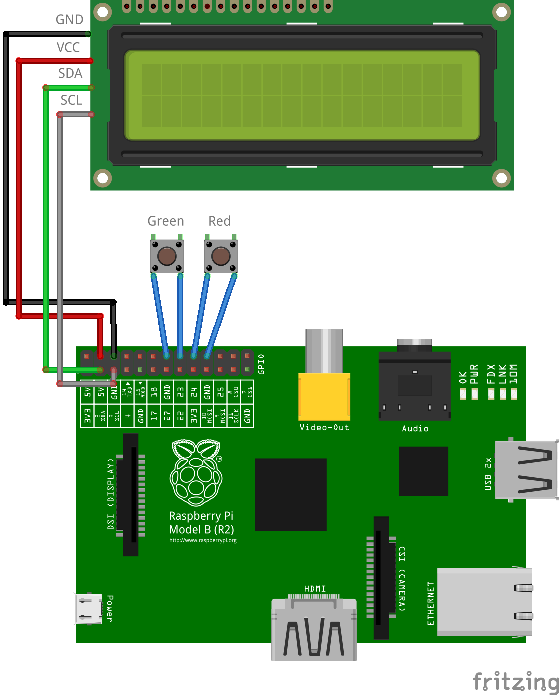

Poll client machine
===================

NodeJS application running on the poll client machine which stands outside the conference rooms.

Hardware
--------
Each machine has 2 push buttons to track polls and an LCD screen display to show the conference to vote to.

Here is the wiring schematic :



**I2C installation**
In order to use the i2c port for the LCD module, you have to do the following on a raspbian :

```
sudo apt-get install i2c-tools
```

Disable blacklist for the modules in `/etc/modprobe.d/raspi-blacklist.conf`:

```
#blacklist spi-bcm2708
#blacklist i2c-bcm2708
```

Activate the i2c driver at boot time in `/etc/modules`:

```
i2c-dev
```

Software
--------
The client is composed of several modules. You can activate the DEBUG mode in order to emulate the hardware through
virtual modules :
```
DEBUG=1 node client.js
```

**The button module** is used to initialize GPIO pin, to handle push button and emit event when detecting the push
and release. The event `pushed` is emitted when the button is pushed, the event `released` is emitted when the button
is released. A software debounce is in place to avoid repeated fake events. You can also get the state button
(`up` or `down`) at anytime.

The virtual debug module starts an HTTP server defined with the pin button number
(eg: button pin 27 starts an HTTP server on 9027 port).
You can call the following url to emulate the button :

- `/pushed`: the button is pushed
- `/released`: the button is released
- `/click`: the button is pushed the released 500ms after


**The lcd module** is used to print text on the LCD screen. The screen is connected on the i2c bus.

The virtual debug module starts a socket server and print data onto the user console, you can use netcat or telnet
to connect on the socket:

```
nc localhost 9139
```